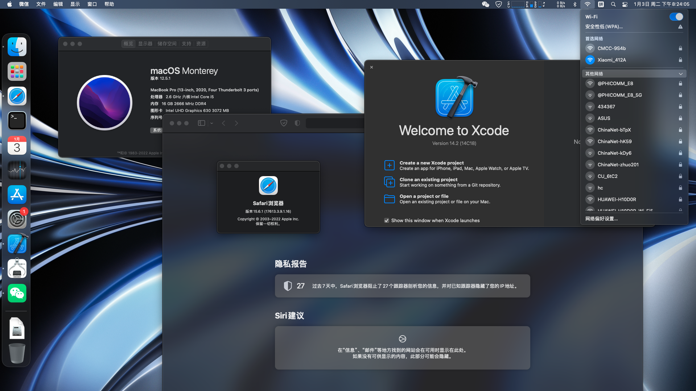

# Info

- Dell-Inspiron-7590

- OC: 0.7.8
 
- MacOS Monterey 12.5.1 (21G83)
 
- Ability to use wifi and bluetooth

(Ventura has not been tested. I will test it after 13.4 is released)

---

# Monterey

---

# Hide

[hide.png](/img/hide.png)

[bug.jpg](/img/bug.jpg)

---

# Re

https://github.com/Pinming/Dell-Inspiron-7590-Hackintosh-Opencore

https://github.com/hacker1024/Dell-Inspiron-7586-Hackintosh

https://github.com/CMDQ8575/Dell-Inspiron-7590-OpenCore
